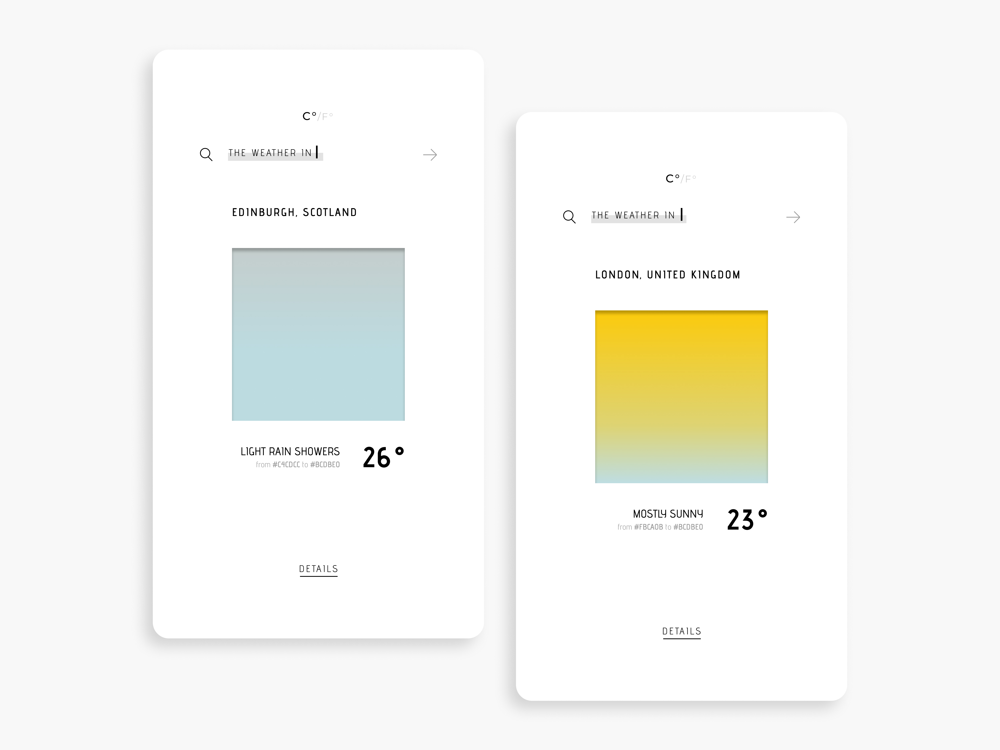

# Weather API

Yet another weather app 🌦️

Designed in Figma and developed using React.

## Installation

    $ git clone git@github.com:sonickonic/weather-api.git
    $ cd weather-api
    $ npm install

## Run the app

    $ npm start 